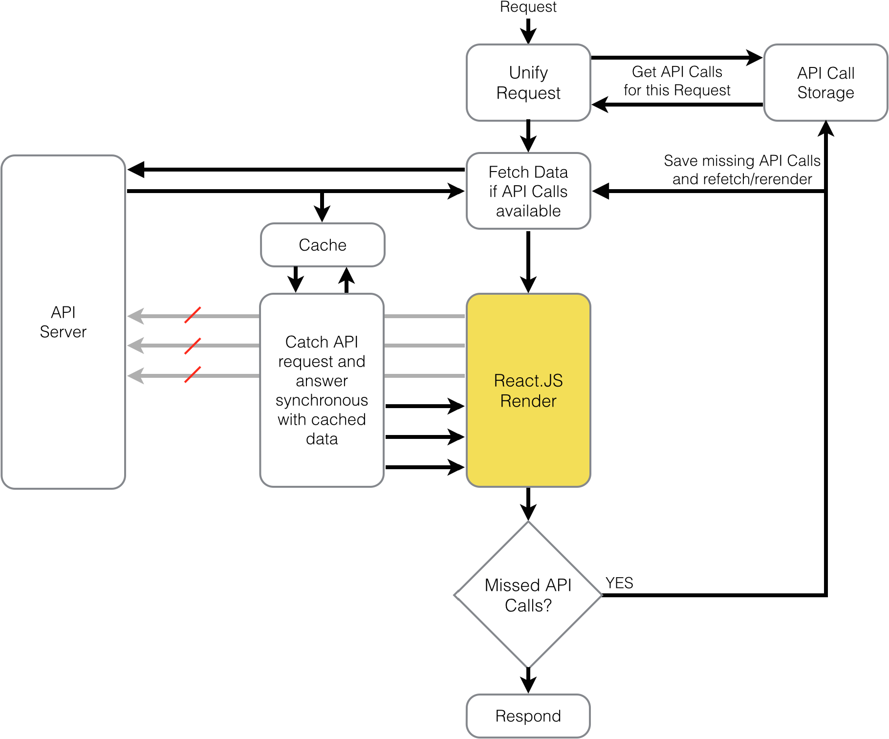

# How it works
The basic idea of UniJS is the following procedure:

1. Guess which data is needed to render (url as basis of guess)
2. Fetch this data
3. Call React.renderToString() to render the app
4. Catch all async AJAX Requests and answer in sync with prefetched data

To understand this easier I created a diagram:

When you optimize your app it is possible to guess each request correctly after the react-router route which is matching has be called once.
